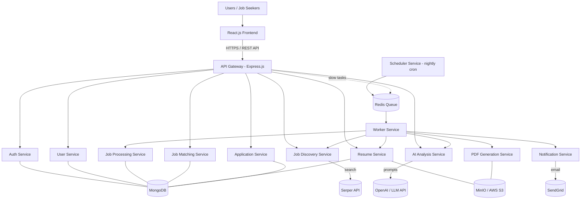

# AI-Powered Job Discovery & Resume Automation Platform

> **Find Jobs Smarter · Build Resumes Faster · Get Hired Sooner**

A full-stack MERN application that automatically discovers job openings on a schedule, filters out the stale and duplicate ones, uses AI to judge whether each job genuinely matches a user's profile, and then generates a job-specific, **truthful** resume as a LaTeX-compiled PDF.

This repository is the **starting skeleton**. Almost every file is empty — your job is to fill it in. Read this document completely before writing a single line of code.

---

## Table of Contents

1. [What You Are Building](#1-what-you-are-building)
2. [Technology Stack](#2-technology-stack)
3. [System Architecture](#3-system-architecture)
4. [Repository Structure](#4-repository-structure)
5. [The Two Core Flows](#5-the-two-core-flows)
6. [Data Model](#6-data-model)
7. [REST API Surface](#7-rest-api-surface)
8. [Local Setup](#8-local-setup)
9. [Git Workflow — Read This Before You Push](#9-git-workflow--read-this-before-you-push)
10. [Implementation Phases](#10-implementation-phases)
11. [Non-Negotiable Rules](#11-non-negotiable-rules)
12. [Testing Requirements](#12-testing-requirements)
13. [Definition of Done](#13-definition-of-done)
14. [Be Ready to Explain This in an Interview](#14-be-ready-to-explain-this-in-an-interview)

---

## 1. What You Are Building

The problem: job hunting is repetitive. You search the same keywords every day, open dozens of listings, most are stale or irrelevant, and for the good ones you hand-edit your resume to match the job description.

This platform automates that loop:

| Step | What the system does |
|------|----------------------|
| 1 | A **scheduler** wakes up every night — no browser needed |
| 2 | Searches job sites through the **Serper API** using configured roles, skills and locations |
| 3 | **Normalizes** every raw search result into one internal job shape |
| 4 | **Deterministic filters** drop stale, duplicate, and invalid jobs using plain code |
| 5 | An **LLM** semantically qualifies what survives — is this really the right role? |
| 6 | Qualified jobs are stored in **MongoDB** |
| 7 | The **React dashboard** shows them with a match score |
| 8 | User opens a job → AI **analyzes** it against their profile and explains the score |
| 9 | User clicks *Generate Resume* → AI selects only **truthful** profile content |
| 10 | A controlled **LaTeX template** is populated and compiled to **PDF** |
| 11 | User reviews, downloads, applies, and **tracks** the application status |

**Scope boundary:** this platform helps a user *discover, understand, and prepare*. It does **not** auto-submit applications to job boards unless a platform offers an officially authorized application API. The user always completes the application themselves.

---

## 2. Technology Stack

This is a **MERN stack** project — **M**ongoDB, **E**xpress.js, **R**eact.js, **N**ode.js. Everything else in the table is an external service or tool those four work with.

| Layer | Technology | Purpose |
|-------|-----------|---------|
| Frontend | **React.js** | Job dashboard, filters, job details, profile, resume preview |
| Backend | **Node.js + Express.js** | REST APIs, authentication, business logic |
| Database | **MongoDB** | Users, profiles, jobs, resumes, applications, activity logs |
| API | **REST over HTTPS** | Communication between the React app and the backend |
| Authentication | **JWT + password hashing** | Login sessions and secure credential storage |
| Scheduling | **Node cron** | Runs the job-discovery pipeline every night |
| Cache & Queue | **Redis** | Caches job data, queues background jobs, rate limiting, sessions |
| Background Processing | **Worker service** | Runs slow AI analysis and resume generation outside the web request |
| Job Search | **Serper API** | Searches job listings across LinkedIn, Naukri, Indeed, Glassdoor, and more |
| AI | **OpenAI / LLM API** | Job analysis, requirement extraction, profile matching, resume content |
| Resume | **LaTeX** | Controlled template compiled into a professional PDF |
| File Storage | **MinIO / AWS S3** | Generated resume PDFs, resume templates, user uploads |
| Email | **SendGrid** | Application updates, job alerts, notifications |

**Do not add frameworks, libraries, or infrastructure outside this table without instructor approval.**

---

## 3. System Architecture



**The key architectural idea:** anything slow or unreliable — a Serper call, an LLM call, a LaTeX compile — must **not** block an HTTP request. The scheduler and the API both push work onto a Redis queue, and the worker processes it. The frontend checks the task's status until it's done, and the user can also get an email through SendGrid.

---

## 4. Repository Structure

```
job-automation-tool/
├── .github/
│   ├── CODEOWNERS                 # every PR routes to the instructor for review
│   └── pull_request_template.md   # fill this in on every PR
├── frontend/                      # ← EMPTY. You scaffold the React app here.
└── backend/
    ├── src/
    │   ├── config/                # database.js, redis.js, env.js
    │   ├── gateway/               # single entry point, routes → services
    │   ├── shared/                # code every service imports
    │   │   ├── constants/
    │   │   ├── utils/
    │   │   ├── middleware/
    │   │   ├── errors/            # typed error classes
    │   │   ├── logger/            # structured logging (no secrets!)
    │   │   └── events/            # event names + emitters between services
    │   │
    │   ├── auth-service/          # register, login, JWT, roles
    │   ├── user-service/          # profile, skills, preferences
    │   ├── job-discovery-service/
    │   │   ├── providers/serper/  # the Serper API client lives here
    │   │   └── parsers/           # raw result → internal job shape
    │   ├── job-processing-service/
    │   │   ├── filters/           # freshness, location, role, salary
    │   │   ├── deduplication/     # canonical URL, content hash
    │   │   └── validators/        # is this record even usable?
    │   ├── ai-analysis-service/
    │   │   ├── prompts/           # versioned prompt templates
    │   │   ├── providers/llm/     # LLM client wrapper
    │   │   └── schemas/           # JSON schemas that validate AI output
    │   ├── job-matching-service/
    │   │   └── scoring/           # profile ↔ job match score
    │   ├── resume-service/
    │   │   ├── templates/         # resume section templates
    │   │   └── latex/             # the controlled .tex template
    │   ├── pdf-generation-service/
    │   │   └── compiler/          # LaTeX → PDF, sandboxed
    │   ├── application-service/   # application records + status
    │   ├── notification-service/
    │   │   └── providers/email/   # SendGrid client
    │   ├── scheduler-service/     # cron/ and jobs/ — the nightly trigger
    │   ├── worker-service/        # queues/, processors/, jobs/
    │   └── app.js
    ├── tests/
    ├── uploads/                   # user uploads (profile pictures etc.)
    ├── generated/
    │   ├── resumes/               # .tex output
    │   └── pdfs/                  # compiled PDFs, before upload to MinIO / S3
    ├── .env.example               # copy to .env and fill in
    └── package.json
```

> Folders contain a `.gitkeep` file only so Git tracks the empty directory. **Delete the `.gitkeep` once you add a real file to that folder.**

### Which service owns what?

Before you write code, know where it belongs. A rule that decides "is this job older than 30 days?" is arithmetic — it goes in `job-processing-service/filters/`, **not** into an AI prompt. A judgement like "is a *Senior React Developer* posting a good fit for someone targeting *Frontend Engineer*?" needs understanding of meaning — that belongs in `ai-analysis-service/`.

Spending an LLM call on something `Date.now()` can answer is the single most common mistake in this project. It is slow, costs money, and is less reliable than the three lines of code it replaced.

---

## 5. The Two Core Flows

### Flow A — Nightly Discovery Pipeline (automatic, no user present)

```
scheduler-service (cron)
  └─> pushes a "discover" job onto the Redis queue
        └─> worker-service picks it up
              ├─> job-discovery-service: build queries from searchConfigurations
              │     ├─> Serper API → raw results
              │     └─> parsers/ → normalized job objects
              ├─> job-processing-service:
              │     ├─> validators/    reject records with no usable URL
              │     ├─> filters/       reject stale (>30 days), wrong location, wrong role
              │     └─> deduplication/ reject URL and content duplicates
              ├─> ai-analysis-service: semantic qualification → structured JSON
              ├─> job-matching-service: compute match score against user profiles
              └─> save qualified jobs to MongoDB + write jobProcessingLogs
```

Every run must record: start time, end time, queries executed, raw results found, duplicates removed, stale jobs removed, AI-qualified, AI-rejected, API failures, duration, and recent errors. That's what powers the admin dashboard — and what you'll demo in an interview.

### Flow B — On-Demand Resume Generation (user is waiting)

```
User clicks "Generate Resume" on a job
  └─> API accepts the request and returns 202 Accepted immediately
        └─> task queued in Redis
              └─> worker-service:
                    ├─> ai-analysis-service:    extract job requirements
                    ├─> job-matching-service:   compare against the user's profile
                    ├─> resume-service:         select TRUTHFUL content, fill LaTeX template
                    ├─> pdf-generation-service: compile .tex → .pdf, store in MinIO / S3
                    └─> notification-service:   email via SendGrid (optional)
  └─> frontend checks GET /api/resumes/:id until status is "completed" → shows the preview
```

### AI output must be structured

Never let the model return free-form prose that you then try to parse. Constrain it to a schema and validate the response in `ai-analysis-service/schemas/` before anything downstream touches it:

```json
{
  "isRelevant": true,
  "freshness": "recent",
  "matchScore": 87,
  "requiredSkills": ["React", "Node.js", "MongoDB"],
  "preferredSkills": ["AWS"],
  "experienceRequired": "1-3 years",
  "employmentType": "Full-time",
  "workMode": "Hybrid",
  "reasons": ["Strong match with user's React and Node.js skills"],
  "redFlags": []
}
```

If validation fails, treat it as a failed AI call and retry — never save a half-parsed object to the database.

---

## 6. Data Model

MongoDB collections:

| Collection | Holds |
|------------|-------|
| `users` | Authentication and account information |
| `profiles` | Skills, education, experience, projects, certifications, preferences, links |
| `jobs` | Normalized job records + qualification metadata |
| `jobProcessingLogs` | Discovery/AI processing status, statistics, errors |
| `resumes` | Generated versions, LaTeX source, metadata, file references |
| `applications` | Jobs the user decided to apply to, and their status |
| `searchConfigurations` | Keywords, roles, locations, freshness rules, allowed/blocked sources |

**The profile is the source of truth.** Everything the resume generator is allowed to say about the user must trace back to a field in `profiles`.

### Normalized job shape

Whatever the source, every job becomes the same internal shape (where the data is available): title, company, location, job URL, source, search snippet, posted date, and raw/extracted description.

### Deduplication signals

The same job appears in many searches. Use more than one signal:

1. Canonicalized URL (strip `utm_*` and other tracking params, fragments, trailing slashes)
2. Source + external job ID, when the source exposes one
3. Normalized company + title + location
4. Content hash of the normalized description

### Application statuses

`Saved` → `Resume Generated` → `Applied` → `Interview` → `Rejected` / `Offer` / `Closed`

---

## 7. REST API Surface

| Method | Endpoint | Purpose |
|--------|----------|---------|
| POST | `/api/auth/register` | Create account |
| POST | `/api/auth/login` | Authenticate, return JWT |
| GET | `/api/profile` | Get the signed-in user's profile |
| PUT | `/api/profile` | Update profile |
| GET | `/api/jobs` | List qualified jobs (paginated, filterable) |
| GET | `/api/jobs/:id` | Job details |
| POST | `/api/jobs/:id/analyze` | Analyze job against profile |
| POST | `/api/jobs/:id/generate-resume` | Generate tailored resume |
| GET | `/api/resumes/:id` | Resume metadata |
| GET | `/api/resumes/:id/pdf` | Download the generated PDF |
| POST | `/api/applications` | Create application record |
| PATCH | `/api/applications/:id` | Update application status |

Everything except `/api/auth/*` requires a valid JWT. Every database query **must** be scoped to the authenticated user — see §11.

### Frontend screens to build

- Login / Register
- Profile (the resume source of truth)
- Job Dashboard
- Job Details, with the AI analysis
- Job Filter / Search
- Match-Score Explanation
- Resume Generation
- Resume Preview / Download
- Application Tracking
- Settings
- *(advanced)* Admin Pipeline Dashboard

A **job card** shows: title, company, location/work mode, posted date, match score, key skills, source, job URL, and status.

---

## 8. Local Setup

### Prerequisites

- Node.js (LTS version)
- MongoDB — a local install or a managed MongoDB instance
- Redis
- A LaTeX distribution installed, to compile `.tex` files into PDF
- MinIO running locally, or an AWS S3 bucket
- API keys: Serper, OpenAI / LLM, SendGrid

### Steps

```bash
# 1. Clone the repository
git clone https://github.com/rudranilbanerjee/job-automation-tool.git
cd job-automation-tool

# 2. Configure the backend
cd backend
cp .env.example .env
#    Open .env and fill in every value. Never commit this file.

# 3. Install and run the backend
npm install
npm run dev
```

The React.js app lives in `frontend/`, which is empty. Create the React app there, and point its API base URL at the backend.

### Verify your setup works

- [ ] The gateway health check responds
- [ ] MongoDB logs a successful connection
- [ ] Redis logs a successful connection
- [ ] You can register a user and receive a JWT
- [ ] A **manually triggered** discovery run inserts at least one job

Build the manual trigger early. You cannot wait until midnight to find out your pipeline throws.

---

## 9. Git Workflow — Read This Before You Push

**`main` is protected. You cannot push to it directly.** All work arrives through a pull request, which the instructor reviews and merges.

```bash
# Start every task from an up-to-date main
git checkout main
git pull origin main

# Create a branch named after what you're doing
git checkout -b feature/auth-service

# Work, then commit in small, logical pieces
git add backend/src/auth-service
git commit -m "Add JWT token generation and verification"

# Push your branch
git push -u origin feature/auth-service
```

Then open a pull request against `main` on GitHub and fill in the template. The instructor reviews it, requests changes or approves, and merges.

**Branch naming:** `feature/<what>`, `fix/<what>`, `docs/<what>`

**Commit messages:** imperative mood, describe *what changed*. `Add deduplication by canonical URL` — not `update`, `fix stuff`, or `final code v2`.

**Before you open a PR:**

- [ ] Your branch is up to date with the latest `main`
- [ ] No `.env`, API keys, or `node_modules/` in the diff
- [ ] Your code runs
- [ ] Tests for the logic you added pass

---

## 10. Implementation Phases

Build in this order — each phase depends on the ones before it. **Do not start Phase 6 until Phase 5 works.** An AI call layered on top of a broken pipeline is nearly impossible to debug.

| Phase | Deliverable | Where you'll be working |
|-------|-------------|-------------------------|
| 1 | Project setup, auth, MongoDB connection, React routing | `config/`, `auth-service/`, `frontend/` |
| 2 | User profile and job-search configuration | `user-service/`, profile + settings screens |
| 3 | Serper integration and job normalization | `job-discovery-service/providers/serper/`, `parsers/` |
| 4 | Nightly scheduler and database storage | `scheduler-service/cron/`, `scheduler-service/jobs/` |
| 5 | Deterministic filtering and deduplication | `job-processing-service/filters/`, `deduplication/` |
| 6 | AI extraction, classification, and matching | `ai-analysis-service/prompts/`, `schemas/` |
| 7 | Job dashboard and job-details UI | `frontend/` |
| 8 | AI job analysis against the user profile | `job-matching-service/scoring/` |
| 9 | Tailored resume generation | `resume-service/` |
| 10 | LaTeX compilation and PDF generation | `pdf-generation-service/compiler/` |
| 11 | Application tracking and resume versioning | `application-service/`, `resume-service/` |
| 12 | Security, testing, logging, deployment, docs | everywhere |

### Resume versioning (Phase 11)

Every generation is a **version** — *Resume v1 for Job A*, *Resume v2 for Job B*. Store the creation timestamp, associated job ID, a snapshot of the profile data used, the LaTeX source, and the PDF reference. When a user updates their profile they can regenerate — and the old version must still exist.

---

## 11. Non-Negotiable Rules

These are not suggestions. A submission that violates them is not complete.

### The AI must never fabricate

The resume generator combines the user's **verified profile** with a job description. It may rewrite and reorder — it may not invent.

- ❌ Never invent employment history or years of experience
- ❌ Never claim a technology the profile doesn't list
- ❌ Never invent degrees, certifications, companies, clients, metrics, or achievements
- ✅ If a job needs a skill the user lacks, report it as a **gap** — that's useful information, not a problem to paper over
- ✅ The user reviews every generated resume before using it

A resume is a document a real person puts their name on and sends to an employer. A fabricated claim on it can cost them the job — or worse, get them hired into a role they can't do. Treat "the model made it up" as a bug of the highest severity.

### Security

- Hash passwords securely. Never store or log plaintext passwords.
- API keys live in environment variables. **Never in source code, never in a commit.**
- Validate every request body and query parameter.
- Rate-limit expensive endpoints — AI analysis and resume generation especially.
- Never return internal stack traces to the client.
- Use HTTPS in production.
- Restrict scheduler and admin endpoints.
- **Sanitize everything before it reaches LaTeX.** Unescaped user input in a `.tex` file can execute commands on your server — it is a security hole, not a formatting bug.
- **One user must never be able to read another user's profile, resume, or applications.** Scope every database query by the authenticated user's ID, and write a test that proves it.

### Crawling and compliance

A search API returning a URL is **not** permission to scrape the site behind it. Respect each source's terms of service, `robots.txt`, rate limits, and authentication requirements. Prefer official or public APIs. Document which sources you used and why you believe you're permitted to use them.

### Reliability

- Set a timeout on every external API call
- Retry transient failures — with a limit and backoff
- Track task state: `pending` → `processing` → `completed` / `failed`
- Never process the same job twice
- Log enough to debug, but never log secrets or tokens

---

## 12. Testing Requirements

Write tests in `backend/tests/`:

- [ ] Unit tests for filtering and scoring logic
- [ ] API tests for auth and job endpoints
- [ ] Duplicate-detection tests
- [ ] Stale-job detection tests
- [ ] **Mocked** Serper/LLM failure tests — the pipeline must survive the API being down
- [ ] Resume generation tests with a known profile + job pair
- [ ] LaTeX compilation *failure* tests — a broken template must fail cleanly, not crash the service
- [ ] Authorization tests proving users cannot access each other's data
- [ ] One end-to-end test: discovery → qualification → display → analysis → resume

---

## 13. Definition of Done

The project is complete when this full chain works:

1. The scheduler starts automatically
2. Search queries run through the discovery service
3. Results are normalized
4. Stale, duplicate, and invalid jobs are removed
5. AI evaluates semantic relevance
6. Qualified jobs are stored in MongoDB
7. The React app displays them
8. A user opens a job description
9. The system analyzes it against their profile
10. A match score **and the reasons for it** are shown
11. The user requests a tailored resume
12. AI selects and rewrites only truthful, relevant profile content
13. A controlled LaTeX template is populated
14. The document compiles to PDF
15. The user reviews and downloads it
16. The user records the application status

---

## 14. Be Ready to Explain This in an Interview

This project is only worth as much as your ability to talk about it. Prepare answers for:

- Why MongoDB, and how are the collections structured?
- How does the nightly scheduler work?
- What happens when an external API fails?
- **Why are deterministic rules and AI separated?**
- How do you detect duplicate jobs?
- How is the AI prompt structured, and how do you validate its output?
- How is a profile matched against a job?
- **How do you prevent fabricated resume claims?**
- How is LaTeX generation secured?
- How would you move long-running AI tasks to a queue and worker?
- How would this scale to many users?
- How are API keys and user data protected?

### How to describe this project on your resume

> **AI-Powered Job Discovery & Resume Automation Platform | MERN Stack**
> - Built a MERN platform that automatically discovers and qualifies job opportunities using scheduled background processing, search APIs, deterministic filters, and AI-assisted semantic analysis.
> - Implemented job freshness checks, relevance scoring, skill extraction, deduplication, and personalized matching against structured user profiles.
> - Developed an AI-driven resume workflow that converts job requirements and verified user experience into ATS-friendly LaTeX resumes and PDFs.
> - Implemented resume versioning and application tracking with secure authentication, API-key management, validation, and user-level data isolation.

---

**Stuck?** Open an issue on this repository. Don't stay stuck silently for three days.
